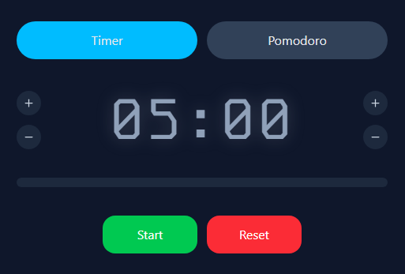
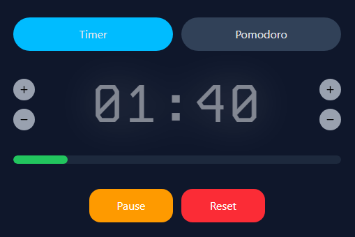
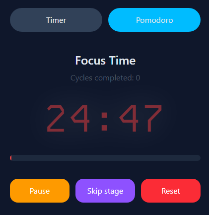
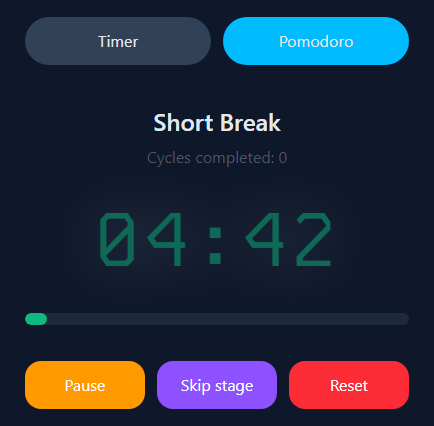

# Timer / Pomodoro

    

---

## 📚 Table of Contents

- [Project Description](#Project-Description)
- [Main Features](#main-features)
- [What I Learned](#what-i-learned)
- [Tech Stack](#tech-stack)
- [Screenshots](#screenshots)

---

## 📝 Project Description

This project is a timer / pomodoro application built to practice React and TypeScript.
It includes state management, component communication, and UI updates based on user actions.

---

## ⭐ Main Features

- Configurable timer. 
- Timer controls: **Start, Pause, Restart, Reset**.
- Countdown updated every second.
- Display in **MM:SS** format.
- Automatically stops at **0**.
- Notifications with sound and system notifications.
- Pomodoro mode: 
    - 25-minute work session 
    - 5-minute short break
    - 15-minute long break every four cycles.
- Progress bar.
- State persistence afeter page refresh.

---

## 🎯 What I Learned

- Used the `Notification API` to request permissions and displat system notifications.
- Used `@font-face` to load custom fonts.
- Played sounds using `.play()` when the timer or Pomodoro ends.
- Worked with **lucide-react** for icons.
- Improved my understanding of **`useEffect`**.
- Used `useCallback()` to avoid unnecesary function recreation on each render.
- Used `setInterval()` for recurring tasks.
- Used `@theme` in `index.css` to create custom breakpoints.
- Used a **custom hook** to separate component logic and keep the codebase clean.
- Extracted constants.
- Created separate files for TypeScript types.
- Practiced **communication between components**.
- Wrote strongly typed components with **TypeScript**.
- Applied **clean code principles**.
- Organized the project following a clear folder structure.
- Built a **responsive design** with Tailwind CSS.

---

## 🧰 Tech Stack

- **Vite**
- **React + TypeScript**
- **Tailwind CSS**
- **Git**

---

## 📸 Screenshots

### Timer

### Pomodoro

